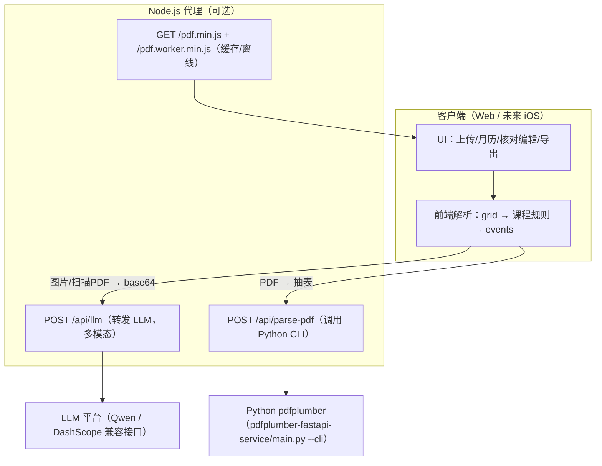

# 析课 - 智能课表生成工具

**析课** 是一个“解析 + 校对 + 生成”的课表工具：核心能力在前端（静态页/纯本地可运行），并可选接入 Node.js 代理与 Python（pdfplumber）来增强能力（LLM 多模态识别、PDF 抽表）。支持 Excel / PDF / 图片输入，输出月历视图，并支持 ICS 与离线 HTML 导出。适用于高校学生与教师，将复杂课表“解压缩”为直观日程。

## 🌟 开发背景

高校教务系统导出的课程表通常是以“一周”为循环单元的静态表格。然而在实际教学中，情况远比“一格一课”复杂：同一个时间单元格内可能堆叠了多门不同周次的课程，这些课程可能存在单双周轮换、各周次授课地点不固定等复杂情况。这意味着，一张看似清爽的 Excel 表格，实际上在每个细小的单元格中都高度“压缩”了多维度的、动态的教学时空信息。

对于广大师生而言，每次提取并解读课表信息的过程，实质上都是一次非常耗费精力的“大脑解压缩”过程。由于信息密度巨大，传统的手动解读方式不仅效率低下，而且极其容易出错（例如记错周次、走错教室等）。因此，开发一个能够对“压缩课表”进行自动解析（解压缩）并还原为直观日程的程序工具，不仅能极大程度上解放大脑逻辑，更是提升校园生活和工作效率的一项刚需。

## ✨ 主要功能
- 双阶段解析：先把课表还原为表格 grid，再对单元格做 正则 + LLM 语义解析。
- Excel/PDF/图片输入：Excel 表格上传；PDF 可用 pdfplumber 抽表；图片/扫描件走 Qwen-VL 视觉识别输出 grid。
- 扫描 PDF 兜底：若抽表失败，可将 PDF 第 1 页渲染成图片并调用 LLM 生成 grid。
- 月历视图：按月展示、颜色区分时段、周次提示。
- 课程核对/编辑：支持新增/修改/删除；时间冲突会阻止保存；同一时间同一地点仅提示用户确认（不强制合并）。
- 周次解析增强：支持 `1,3,5`、`1-16`、`第1-16周(单/双)`、`第2,4,6,...,16周` 等输入。
- 编辑日志：核对/编辑窗口底部日志按北京时间（GMT+8）显示。
- 导出与打印：ICS 导出、离线 HTML（含标题/Logo/网站链接；导出时优先内嵌 Logo 为 data URL，避免离线破图）、A4 打印优化。
- 个性化节次：分段联动的时间微调（1-4、5-8、9-10）。

## 🏗️ 系统架构



- 前端（核心）：HTML/CSS/JS 负责 UI、解析管线、月历渲染、核对编辑与导出。
- Node 代理（可选）：[server_debug.js](./server_debug.js) 提供认证、限流、LLM 转发与 PDF 解析入口。
- Python（可选）：[main.py](./pdfplumber-fastapi-service/main.py) 负责 pdfplumber 表格抽取；既可被 Node 以 CLI 方式调用，也可单独以 FastAPI 方式运行。

## 🧩 模块说明
- 前端入口：index.html、script.js、llm_parser.js、time_utils.js、style.css。
- Node 服务：server_debug.js，提供 /api/llm、/api/parse-pdf、/api/auth/login/logout、/healthz。
- Python 服务：pdfplumber-fastapi-service/ 目录，FastAPI + pdfplumber（同时支持 `main.py --cli`）。

## 📱 iOS App 开发对照（给 Agent）

目标：用 iOS 原生实现与 Web 版本一致的“解析 → 校对 → 生成 → 导出”行为。建议把 iOS 工程按下面的模块边界拆分，便于与现有实现一一对应。

### 1) 关键数据结构（与前端一致）
- Grid：`[[String]]`，二维表格（按行/列）。来源：Excel/PDF 抽表或 LLM 识别。
- CourseRule（课程规则，生成 events 的唯一来源）：
  - `id: String`
  - `name: String`（规范化后的课程名）
  - `rawName: String`（尽量保留原始名，用于展示/追溯）
  - `dayOfWeek: Int`（1-7，周一=1）
  - `periodRange: String`（例如 `"1-2"`）
  - `weeksRaw: String`（用户输入/展示用，例如 `"第1-16周(单)"` 或 `"第2,4,6,...,16周"`）
  - `weeks: [Int]`（解析后的周次数组，去重排序）
  - `location: String`
  - `className: String`
  - `source: String`（`auto`/`manual`）
  - `createdAt: Int64`（毫秒时间戳）
- Event（日历事件）：
  - `title/rawTitle/location/className/week/dayOfWeek/periodRange/startTime/endTime/date/timeOfDay`（详见前端 `scheduleLLMGenerateEventsFromCourseRules` 的输出字段）

### 2) 解析与生成管线（建议直接对齐现有 JS 函数）
- LLM/图片解析：对齐 `llm_parser.js`（核心入口是“图片 → grid”）。
- 周次解析：对齐 `time_utils.js` 的 `parseWeekString()` 与 `formatWeekRanges()`；同时兼容逗号列表、范围、单双周，以及 `"第2,4,6,...,16周"`。
- 课程规则规范化：对齐 `script.js` 的 `scheduleLLMNormalizeCourseRuleInput()`。
- 冲突校验策略：对齐 `script.js` 的 `scheduleLLMValidateCourseRules()`：
  - 若时间区间重叠：直接视为不可保存的冲突。
  - 若“同一周 + 同一天 + 同一节次时间段 + 同一地点”：仅提示用户确认（warning），不自动合并。
- 规则 → 事件：对齐 `script.js` 的 `scheduleLLMGenerateEventsFromCourseRules()`（用开学日期 + 周次 + 星期推导具体日期）。
- 月历渲染：Web 用 DOM；iOS 可用 `UICollectionView`/SwiftUI Grid，但事件分组逻辑建议对齐：同一日内按 `period + location + title + className` 作为显示分组键，避免误合并。

### 3) 时间与时区
- 编辑日志时间：Web 端显示为北京时间（Asia/Shanghai）。iOS 端同样建议以 `TimeZone(identifier: "Asia/Shanghai")` 格式化显示，避免 UTC。

### 4) 导出策略（iOS 对齐行为）
- ICS：对齐 Web 导出字段（课程名、地点、时间段、提醒等可选）。
- 离线 HTML：Web 导出会优先把 Logo 转成 data URL 内嵌，离线打开不依赖同目录资源；若无法内嵌，则通过 `img.onerror` 隐藏图标避免破碎图标。iOS 若也提供 HTML 导出，建议同策略。

### 5) 可选后端对接（iOS）
- 若需要 LLM 识别或 PDF 抽表：建议复用 Node 代理（同 Web），iOS 只需调用 `/api/llm` 与 `/api/parse-pdf`。
- 若仅做本地：iOS 需要自行实现 Excel 读取与 PDF 抽表（或限制输入类型）。

## 🔄 数据流
1. 用户上传 Excel / PDF / 图片。
2. Excel：直接读表格 grid，进入前端解析管线（正则 + LLM）。
3. PDF：调用 `/api/parse-pdf`（pdfplumber）抽表为 grid；若 grid 为空则将 PDF 第 1 页渲染成图片并调用 `/api/llm`（Qwen-VL）生成 grid。
4. 图片：前端压缩后直接调用 `/api/llm`（Qwen-VL）输出 grid。
5. grid 进入前端解析与生成：按节次/星期映射为日历事件，支持导出与打印。

---

## 🚀 快速开始

### 方式一：直接使用
如果已部署到静态站点（如 GitHub Pages），直接访问链接即可使用。但无法使用LLM调用。

### 方式二：本地运行（全功能）
1. 安装 Node.js 20+ 与 Python 3.10+。
2. 在根目录创建 `.env`：
   ```env
   PORT=3001
   REQUIRE_AUTH=true
   AUTH_USER=admin
   AUTH_PASS=请填入密码
   JWT_SECRET=请填入随机密钥

   LLM_BASE_URL=https://dashscope.aliyuncs.com/compatible-mode/v1
   LLM_API_KEY=sk-你的真实密钥
   LLM_MODEL=qwen-flash

   # 允许 /api/llm 接收 base64 图片（上传图片/扫描PDF兜底会用到）
   MAX_LLM_BODY_BYTES=12582912

   ALLOWED_ORIGINS=http://localhost:3001
   ```
3. 安装依赖并启动 Node：
   ```bash
   npm i
   npm run start
   ```
4. 安装 Python 依赖（Node 会通过 CLI 调用 pdfplumber 解析，无需单独启动 Python 服务）：
   ```bash
   cd pdfplumber-fastapi-service
   python3 -m venv .venv && source .venv/bin/activate
   pip install -r requirements.txt
   ```
5. 打开 `http://localhost:3001/`。

如果使用 Nginx 反代，需确保 `/api/llm` 的 `client_max_body_size` 足够大（否则可能 413）。另外建议对 `script.js/llm_parser.js` 禁用强缓存，避免更新后浏览器仍加载旧代码。

### 方式三：仅前端模式
直接打开 `index.html`，可使用正则解析与本地编辑；LLM 需直连配置 API Key，PDF 解析不可用。

---

## ⚙️ 配置说明

### 前端配置（可选）
使用 `inject_env.js` 生成 `config.js`（已加入 .gitignore），用于给前端填充默认的 LLM 接口地址与模型：
```bash
LLM_API_URL=/api/llm LLM_MODEL=qwen-flash node inject_env.js
```
提示词已内置在 [llm_parser.js](./llm_parser.js) 的 `parseScheduleImageToGrid` 中，可直接在代码里调整。

### Node 代理环境变量
- PORT：服务端口，默认 3001。
- REQUIRE_AUTH / REQUIRE_SAME_ORIGIN：是否开启鉴权/同源校验。
- AUTH_USER / AUTH_PASS / JWT_SECRET / JWT_TTL_SECONDS：登录与 Cookie 鉴权配置。
- LLM_BASE_URL / LLM_API_KEY / LLM_MODEL：LLM 转发配置。
- MAX_BODY_BYTES：普通 JSON 请求体上限。
- MAX_LLM_BODY_BYTES：`/api/llm` 请求体上限（用于 base64 图片）。
- ALLOWED_ORIGINS / RATE_LIMIT_RPM：跨域与限流。
- PDF_PARSER_PY / PYTHON_BIN / PDF_PARSE_TIMEOUT_MS：PDF 解析脚本与超时配置。

### Python 服务配置
见 pdfplumber-fastapi-service/.env.example。

---

## 🔌 API 文档
- `POST /api/auth/login`：请求体 `{ username, password }`，登录成功后以 Cookie 方式下发令牌。
- `POST /api/auth/logout`：清除认证 Cookie。
- `POST /api/llm`：LLM 转发（支持多模态 `messages[].content` 为数组，包含 `type=image_url`）。
- `POST /api/parse-pdf`：表单上传 `file=*.pdf`，返回结构化表格 `{ grid, pages, ... }`。
- `GET /healthz`：健康检查。
- `GET /pdf.min.js` 与 `GET /pdf.worker.min.js`：PDF.js 资源（离线/内网场景）。

## 📖 使用指南
1. 上传课表（Excel 或 PDF）。
2. 设置开学日期与节次时间。
3. 点击生成日程，查看月历与课程列表。
4. 导出 ICS、打印或保存 HTML。

## ✅ 测试
```bash
npm test
```

## 🛠️ 技术栈
- 前端：HTML5 / CSS3 / Vanilla JS + PDF.js
- 表格抽取：SheetJS (xlsx)、pdfplumber
- 视觉/语义：通义千问 Qwen（DashScope 兼容接口，Qwen-VL 用于图片/扫描件）
- 后端：Node.js（LLM 转发与 PDF 解析入口） + Python（pdfplumber，CLI/可选 FastAPI）

## 📄 许可证
本项目开源，仅供学习交流使用。
